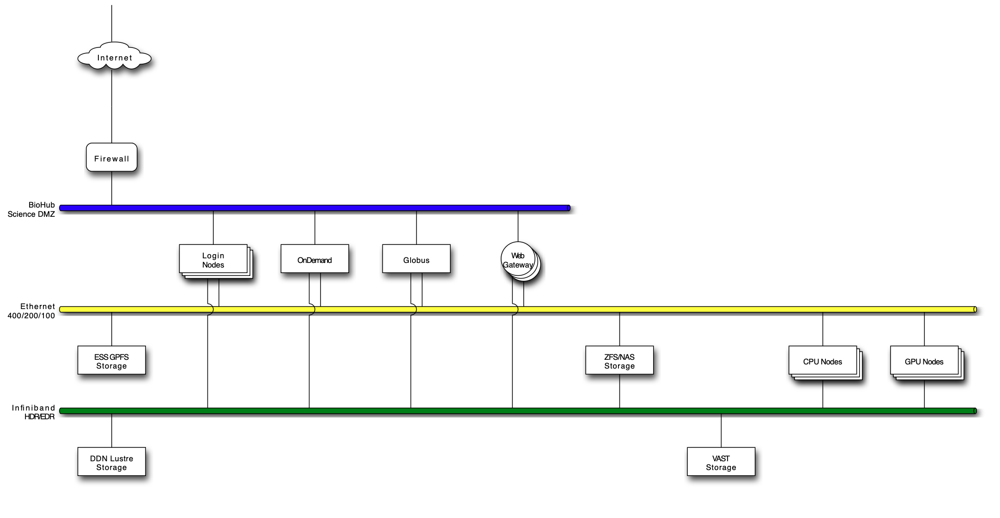

# Hardware

## Bruno

| Category       | Count  |
|---------------|--------|
| Total CPUs    | 5568   |
| Total GPUs    | 216    |
| Total Nodes   | 96     |
| Login Nodes   | 2      |
| CPU Nodes     | 14     |
| GPU Nodes     | 80     |

| Name               | Cores    | CPU Type                  | Memory      | GPUs                |
| ------------------ |----------|---------------------------|-------------| ------------------- |
| `login-[01-02]`    | 128/node | AMD Epyc 7003             | 1 TB/node   | none                |
| `login-fry1`       | 16/node  | INTEL Xeon E5 2609 v4     | 512 GB      | 4 x TitanXP         |
| `login-fry2`       | 16/node  | INTEL Xeon E5 2609 v4     | 256 GB      | 4 x TitanXP         |
| `login-falcon`     | 32/node  | INTEL Xeon E5 2667 v4     | 256 GB      | 3 x TitanRTX        |
| `cpu-a-[1-2]`      | 128/node | AMD Epyc 7H12             | 4 TB/node   | none                |
| `cpu-b-[1-6]`      | 128/node | AMD Epyc 7H12             | 4 TB/node   | none                |
| `cpu-c-[1-4]`      | 24/node  | INTEL Xeon Gold 6126      | 128 GB/node | none                |
| `cpu-e-[1-2]`      | 128/node | AMD Epyc 7763             | 4 TB/node   | none                |
| `gpu-a-[1-4]`      | 128/node | AMD Epyc 7742             | 2 TB/node   | 4 x A100(40GB)/node |
| `gpu-b-[1-6]`      | 128/node | AMD Epyc 7742             | 512 GB/node | 4 x A6000/node      |
| `gpu-c-1`          | 30/node  | AMD Epyc 7773X            | 480 GB/node | 8 x A40 / node      |
| `gpu-d-[1-2]`      | 128/node | AMD Epyc 7773X            | 2 TB/node   | 4 x A100(80GB)/node |
| `gpu-e-[1-8]`      | 16/node  | AMD Epyc 7313P            | 512 GB/node | 1 x A40 / node      |
| `gpu-f-[1-6]`      | 112/node | INTEL Xeon Platinum 8480c | 2 TB/node   | 8 x H100 / node     |
| `gpu-g-[1-2]`      | 64/node  | AMD EPYC 9334             | 1 TB/node   | 4 x L40S / node     |
| `gpu-h-[1-6,8]`    | 64/node  | INTEL Xeon Platinum 8592+ | 2 TB/node   | 8 x H200 / node     |
| `gpu-sm01-[01-20]` | 16/node  | AMD Epyc 7302P            | 256 GB/node | 1 x A40 / node      |
| `gpu-sm02-[01-20]` | 16/node  | AMD Epyc 7302P            | 256 GB/node | 1 x A40 / node      |

| GPU Type      | Bruno Total |
|---------------|-------------|
| A100 (40 GB)  | 16          |
| A100 (80 GB)  | 8           |
| A6000 (48 GB) | 24          |
| A40 (48GB)    | 56          |
| H100 (80 GB)  | 48          |
| H200 (141 GB) | 56          |
| L40S (48 GB)  | 8           |
| Total GPUs    | 216         |

### Storage Nodes/Appliances

| Name                 | FileSystem   | Size        |
| -------------------- | ------------ | ----------- |
| `storage-a-0[1-2]`   | ZFS/NFS      | 900 TB/node |
| `storage-b-0[1-2]`   | ZFS/NAS      | 38 TB/node  |
| `storage-odb2-[1-2]` | ZFS/NAS      | 4.7 PB      |
| `storage-odb5-[1-2]` | ZFS/NAS      | 4.7 PB      |
| `storage-c-1`        | ZFS/NAS      | ~ 4 PB      |
| DDN Appliance EXA1   | Lustre       | 5.9 PB      |
| VAST             | VAST/\[p]NFS | 1 PB        |
[ Storage servers and appliances ]

## CZII

| Name               | Cores      | CPU Type                                     | Memory      | GPUs                |
|--------------------|-----------|----------------------------------------------|------------|---------------------|
| `czii-login[1-2]`  | 64/node   | AMD EPYC 9354P 32-Core Processor            | 514GB/node | none                |
| `czii-cpu-a-[1-2]` | 128/node  | AMD EPYC 9534 64-Core Processor             | 2.3TB/node | none                |
| `czii-gpu-a-[1-2]` | 16/node   | Intel(R) Xeon(R) Gold 6326 CPU @ 2.90GHz    | 1T/node    | 2x NVIDIA A40       |
| `czii-gpu-b-[1-3]` | 64/node   | AMD EPYC 9184X 16-Core Processor            | 1.5TB/node | 8x NVIDIA RTX A6000 |
| `czii-gpu-c-[1-3]` | 128/node  | AMD EPYC 9334 32-Core Processor             | 2.3TB/node | 4x NVIDIA A40       |
| `czii-gpu-d-1`     | 128/node  | Intel(R) Xeon(R) Gold 6438Y+                | 1T/node    | 4x NVIDIA RTX A6000 |

| GPU Type          | Total |
|-------------------|-------|
| A40               | 16    |
| RTX A6000 (48 GB) | 28    |
| Total GPUs        | 44    |

## CHI

| Name               | Cores    | CPU Type                       | Memory    | GPUs           |
|--------------------|----------|--------------------------------|-----------|----------------|
| `chi-login[1-2]`   | 16/node  | AMD EPYC 9354P 32-Core Processor | 128G/node | none           |
| `chi-cpu-a-[1-2]`  | 256/node | AMD EPYC 9754                  | 2.3T/node | none           |
| `chi-cpu-b-[1-2]`  | 256/node | AMD EPYC 9754                  | 1.5T/node | none           |
| `chi-cpu-vm-a-[1-2]` | 8/nodes  | AMD EPYC 9534                | 128G/node | none           |
| `chi-gpu-a-1` | 256/node | AMD EPYC 9754 128-Core Processor    | 2.3T/node | 8x NVIDIA H200 |

# Network View

## Bruno Cluster Network

