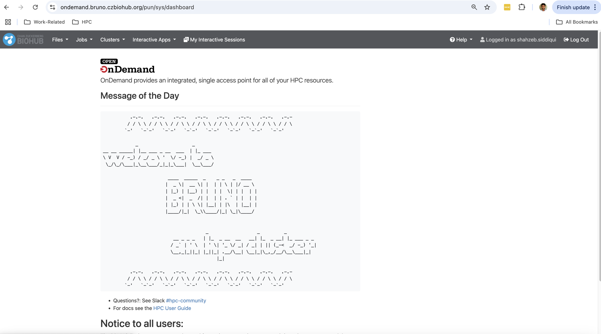
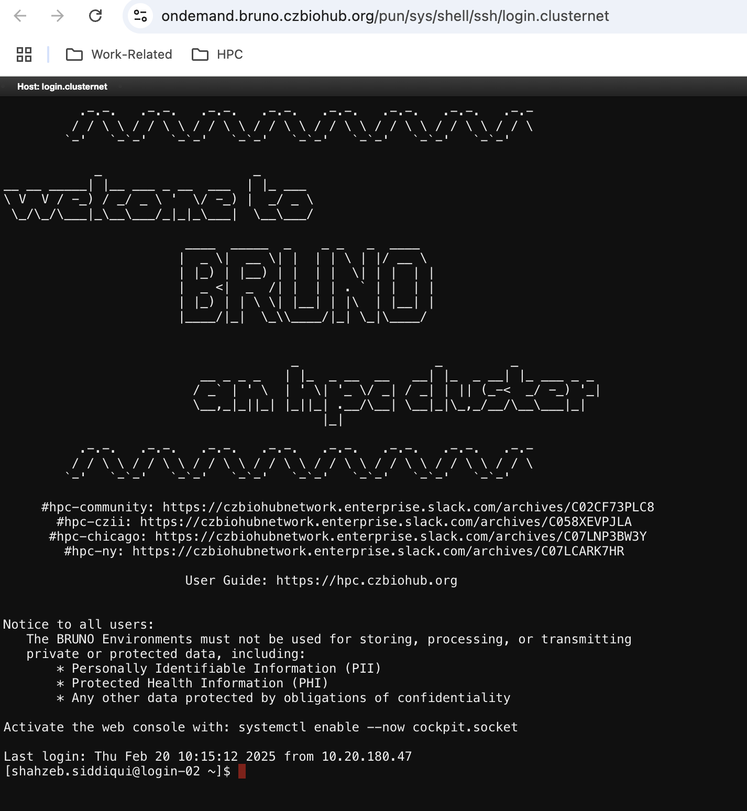
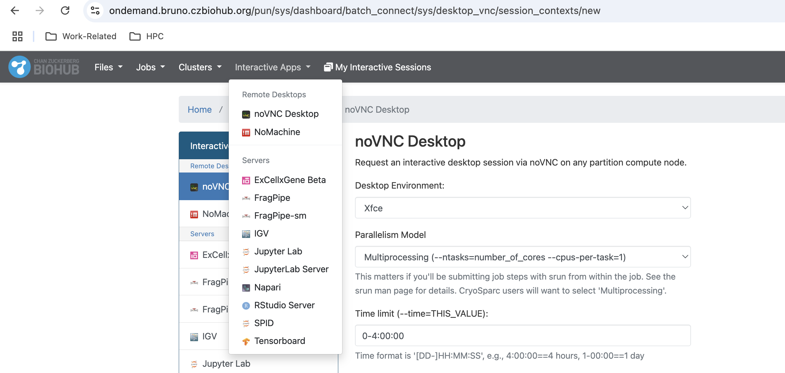
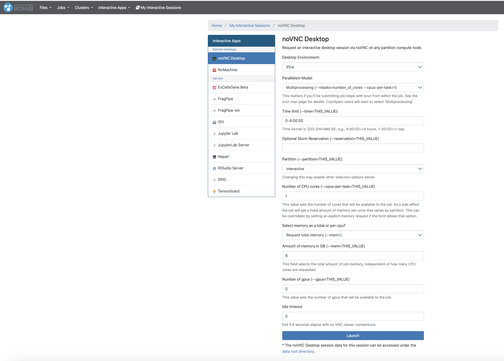
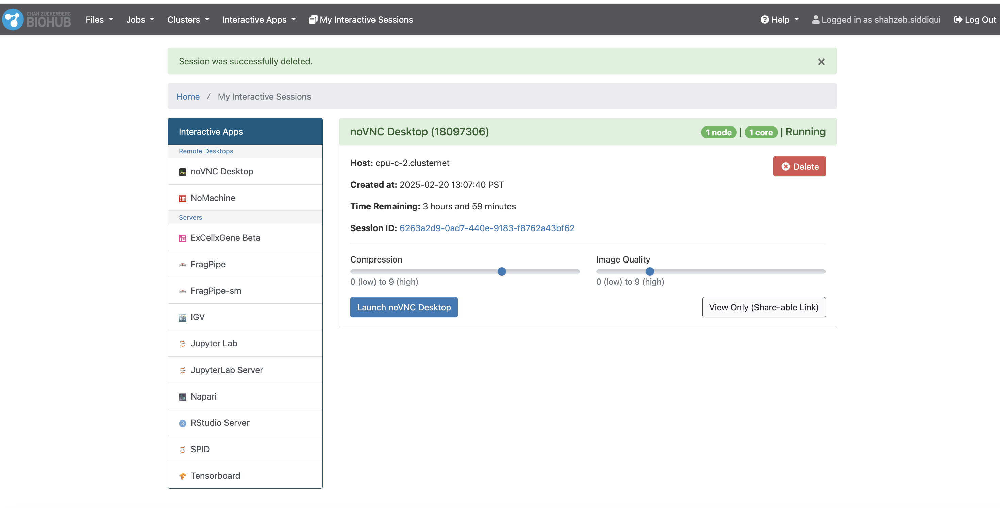
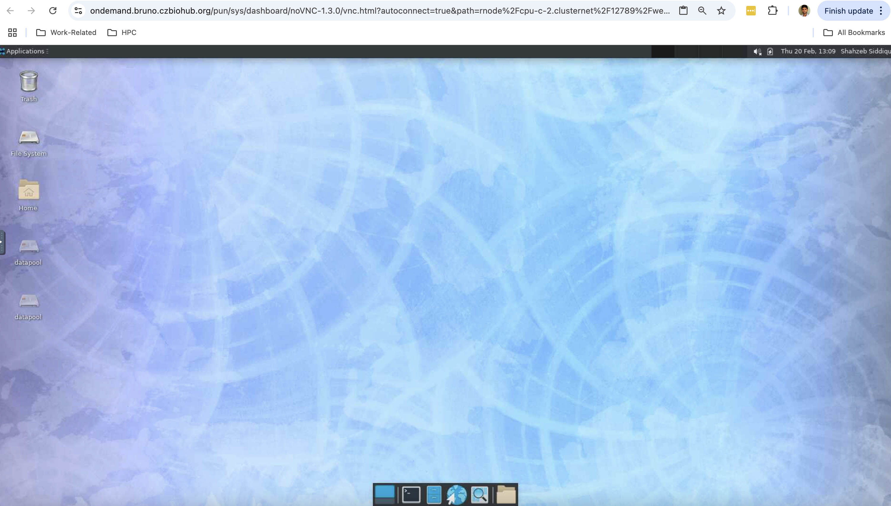
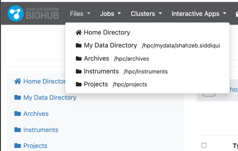
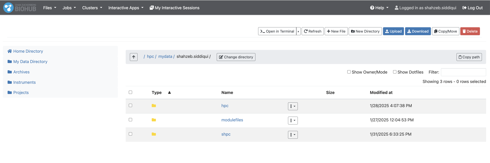

# Connecting with Open OnDemand

## Overview
[Open OnDemand](https://openondemand.org/) interface provides a graphical, web-based
entry point to access the cluster resources. In addition to providing a web based terminal and shell environment, 
similar to using `ssh` to connect, it also provides graphical tools for managing
files/data and submitting jobs. However, the most powerful features of [Open
OnDemand](https://openondemand.org/) are the site applications added to it. The
list of available applications will grow over time, if there's something you'd
like to see there please request it. 

## Accessing Open OnDemand

- Bruno: https://ondemand.bruno.czbiohub.org
- CZII: https://ondemand.czii.czbiohub.org

## Using Open OnDemand

Shown below is the main page for Open OnDemand. 

If you want to get interactive shell you can click `Clusters > _bruno Shell Access`. Once you click this, you will be prompted 
with a new window with a terminal window

## Remote Desktop

You can use `noVNC Desktop` or `NoMachine` to get a remote desktop. The `noVNC Desktop` requires no setup, while NoMachine requires one
to download the [NoMachine client](https://www.nomachine.com/product&p=NoMachine%20Enterprise%20Client)

You can see list of available applications by clicking `Interactive Apps`. Then click on `noVNC Desktop`

You will be prompted to fill the form with the following information, once you are ready click the blue button `Launch`

Next, you will see a list of noVNC sessions, it may take a few minutes to start the session. 

Once the session is started, you can click `Launch noVNC Desktop` which will open a new window with a remote desktop.

## File Management

You can view and manage files from the browser by clicking `Files` on the main page. Then simply click on the desired 
file path such as HOME or My Data Directory.

Once you click on a directory name you will see files, in this menu you can navigate inside each file or directory, create, download, delete
or upload files.

